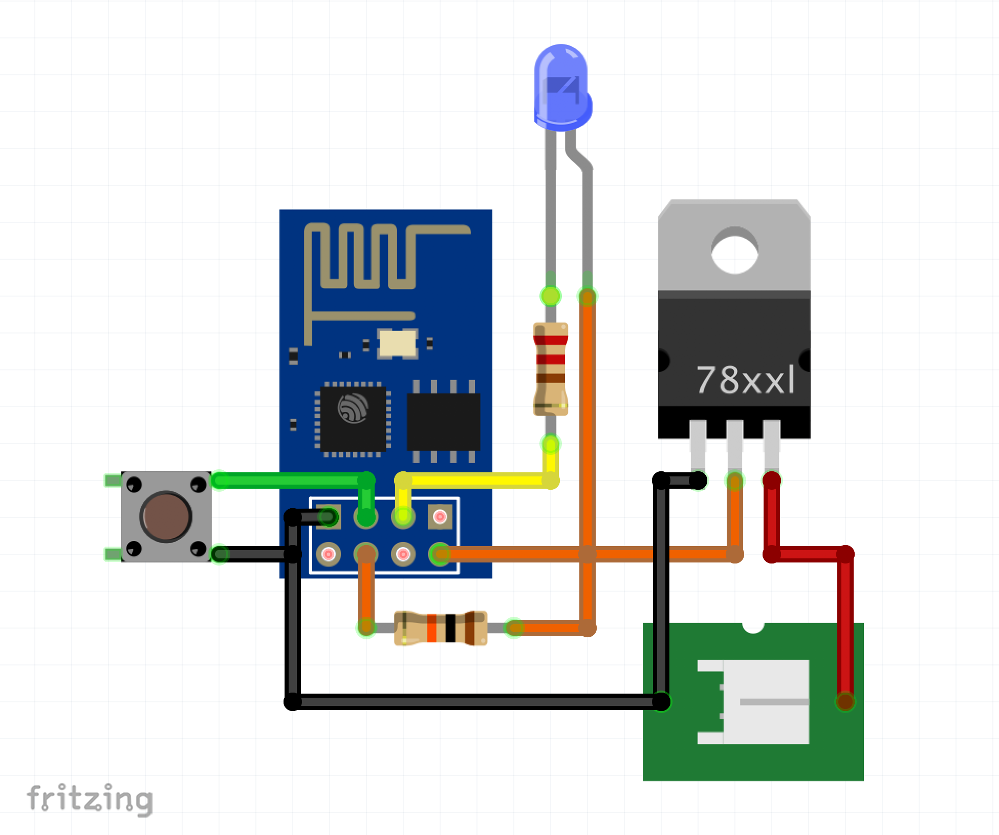

# ESP8266 GoPro Remote

The purpose of this project was to create a low cost Go Pro remote control to set the mode of the camera to Video mode and start/stop recording based on a users input. The aim was to use an ESP8266 - specifically the ESP01 model due to its low cost and availablity. 

## Getting Started

These instructions will get you a copy of the project up and running on your local machine. for development and testing purposes. See deployment for notes on how to deploy the project on a live system.

### Prerequisites

This codebase was developed using and is configured to [Platform IO](https://platformio.org/) in [Visual Code](https://visualstudio.microsoft.com/). 

## Schematic

The following schematic shows the wiring for the remote. Note: This is the schematic after flashing the ESP8266 module. To Flash the the hardware you will need to Serial Module and to enable the flash mode on startup. There are many resources available online to do this (e.g. [nodemcu](https://nodemcu.readthedocs.io/en/master/)).

The [Fritzing](http://fritzing.org/home/) schematic can be found under `./sch`.

### Installing

As mentioned previously, you will need a Serial Module to uppload this codebase to the ESP8266. After flashing the ESP module, the serial module is not required. Using Platform IO, the installation should be as simple as connecting the device in the Flash mode and clicking the integrated `PlatformIO: Upload` button. 

## Built With

* [Platform IO](https://platformio.org/) - PlatformIO is an open source ecosystem for IoT development
* [Visual Code](https://visualstudio.microsoft.com/) - "Best-in-class tools for any developer" - Microsoft

## Authors

* **Chris GW Green**

## License

This project is licensed under the MIT License - see the [LICENSE.md](LICENSE.md) file for details
